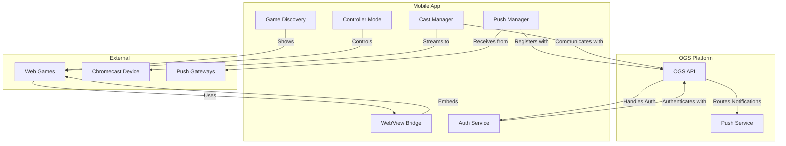

# 📱 Open Game App

> The mobile companion for the Open Game System ecosystem

Open Game App is the official mobile application for the Open Game System (OGS) ecosystem. It enables users to discover OGS-compatible games, receive push notifications, and use their devices as controllers for TV casting. Built with Expo and React Native, the app serves as the bridge between web games and native mobile capabilities.

[](https://reactnative.dev/)
[](https://expo.dev/)
[](https://www.typescriptlang.org/)
[](LICENSE)

## Features

- 🎮 **Game Discovery** - Browse and launch OGS-compatible games
- 🔔 **Push Notifications** - Receive notifications from games
- 📺 **TV Casting** - Cast games to TVs via Chromecast
- 🎛️ **Game Controller** - Use your phone as a controller
- 🔐 **Account Management** - Manage your OGS identity
- 🌐 **WebView Integration** - Seamless web game embedding

## Architecture

The Open Game App acts as a bridge between web games and native mobile capabilities, integrating with the broader OGS ecosystem:



## Development Setup

### Prerequisites

- [Node.js](https://nodejs.org/) (v18 or later)
- [Yarn](https://yarnpkg.com/) or [npm](https://www.npmjs.com/)
- [Expo CLI](https://docs.expo.dev/workflow/expo-cli/)
- [Xcode](https://developer.apple.com/xcode/) (for iOS development)
- [Android Studio](https://developer.android.com/studio) (for Android development)
- [EAS CLI](https://docs.expo.dev/build/setup/) (for building)

### Installation

1. Clone the repository:

```bash
git clone https://github.com/open-game-system/opengame-app.git
cd opengame-app
```

2. Install dependencies:

```bash
yarn install
```

3. Start the development server:

```bash
yarn start
```

4. Run on a device or simulator:

```bash
# iOS
yarn ios

# Android
yarn android
```

## Project Structure

```
opengame-app/
├── src/
│   ├── api/              # API client and services
│   ├── components/       # Reusable UI components
│   ├── hooks/            # Custom React hooks
│   ├── navigation/       # Navigation configuration
│   ├── screens/          # Screen components
│   ├── services/         # Background services (push, cast)
│   ├── store/            # State management
│   ├── types/            # TypeScript type definitions
│   └── utils/            # Utility functions
├── assets/               # Images, fonts, and other assets
├── app.json              # Expo configuration
├── eas.json              # EAS Build configuration
├── index.ts              # Entry point
└── package.json          # Dependencies and scripts
```

## Key Components

### WebView Bridge

The WebView Bridge enables communication between the embedded web games and the native app capabilities:

```typescript
// In the WebView component
<WebView
  source={{ uri: game.url }}
  ref={webViewRef}
  onMessage={handleWebViewMessage}
  injectedJavaScript={bridgeScript}
  // ...other props
/>

// Handle messages from web games
const handleWebViewMessage = (event: WebViewMessageEvent) => {
  const data = JSON.parse(event.nativeEvent.data);
  
  switch (data.type) {
    case 'cast:initialize':
      initializeCast(data.payload);
      break;
    case 'push:register':
      registerForPushNotifications(data.payload);
      break;
    // Other message types
  }
};

// Send messages to web games
const sendMessageToWebView = (type: string, payload: any) => {
  webViewRef.current?.injectJavaScript(`
    window.postMessage(
      ${JSON.stringify({ type, payload })},
      '*'
    );
    true;
  `);
};
```

### Cast Manager

The Cast Manager handles Chromecast integration:

```typescript
import GoogleCast, { CastButton } from 'react-native-google-cast';

// Initialize Cast functionality
useEffect(() => {
  GoogleCast.EventEmitter.addListener(GoogleCast.SESSION_STARTING, () => {
    setIsCasting(true);
  });
  
  GoogleCast.EventEmitter.addListener(GoogleCast.SESSION_ENDED, () => {
    setIsCasting(false);
  });
  
  // Initialize Cast client
  GoogleCast.initializeCast();
}, []);

// Start a cast session
const startCasting = async (castUrl: string) => {
  try {
    await GoogleCast.castMedia({
      mediaUrl: castUrl,
      contentType: 'application/vnd.opengame.cast',
    });
    setCastSessionId(Date.now().toString());
  } catch (error) {
    console.error('Failed to cast:', error);
  }
};
```

### Push Notification Manager

The Push Notification Manager handles device registration and notification reception:

```typescript
import * as Notifications from 'expo-notifications';
import { registerDeviceForNotifications } from '../api/notifications';

// Request notification permissions
const requestNotificationPermissions = async () => {
  const { status } = await Notifications.requestPermissionsAsync();
  return status === 'granted';
};

// Register device token with OGS
const registerDevice = async () => {
  try {
    const token = await Notifications.getExpoPushTokenAsync();
    await registerDeviceForNotifications({
      token: token.data,
      platform: Platform.OS,
    });
    return true;
  } catch (error) {
    console.error('Failed to register device:', error);
    return false;
  }
};

// Configure notification handling
useEffect(() => {
  Notifications.setNotificationHandler({
    handleNotification: async (notification) => ({
      shouldShowAlert: true,
      shouldPlaySound: true,
      shouldSetBadge: true,
    }),
  });
  
  const subscription = Notifications.addNotificationResponseReceivedListener(
    handleNotificationResponse
  );
  
  return () => subscription.remove();
}, []);
```

## Build Process

The app uses EAS Build for creating builds for different environments:

### Development Builds

```bash
# iOS development build
yarn build:dev

# iOS simulator build
yarn build:dev:sim
```

### Preview Builds

```bash
# iOS preview build
yarn build:preview

# iOS simulator preview build
yarn build:preview:sim
```

### Production Builds

```bash
# iOS production build
yarn build:prod
```

### Build Configuration

The build configuration is specified in the `eas.json` file:

```json
{
  "cli": {
    "version": ">=0.52.0"
  },
  "build": {
    "development": {
      "developmentClient": true,
      "distribution": "internal",
      "env": {
        "API_URL": "https://api-dev.opengame.org"
      }
    },
    "development-simulator": {
      "developmentClient": true,
      "distribution": "internal",
      "ios": {
        "simulator": true
      },
      "env": {
        "API_URL": "https://api-dev.opengame.org"
      }
    },
    "preview": {
      "distribution": "internal",
      "env": {
        "API_URL": "https://api-staging.opengame.org"
      }
    },
    "preview-simulator": {
      "distribution": "internal",
      "ios": {
        "simulator": true
      },
      "env": {
        "API_URL": "https://api-staging.opengame.org"
      }
    },
    "production": {
      "autoIncrement": true,
      "env": {
        "API_URL": "https://api.opengame.org"
      }
    }
  }
}
```

## Custom Development

### Adding a New Feature

1. Plan the feature and its integration with the OGS ecosystem
2. Create necessary components, screens, and services
3. Update the WebView bridge if needed for web-to-native communication
4. Test on both iOS and Android platforms
5. Submit a pull request with the changes

### Modifying the WebView Bridge

The WebView bridge is a critical component for communication between web games and native features:

```typescript
// src/services/bridge/injectScript.ts
export const createBridgeScript = () => `
(function() {
  // Create the bridge if it doesn't exist
  if (!window.OpenGameBridge) {
    window.OpenGameBridge = {
      // Cast methods
      cast: {
        initialize: (options) => {
          window.ReactNativeWebView.postMessage(
            JSON.stringify({
              type: 'cast:initialize',
              payload: options
            })
          );
        },
        sendInput: (inputData) => {
          window.ReactNativeWebView.postMessage(
            JSON.stringify({
              type: 'cast:input',
              payload: inputData
            })
          );
        }
      },
      
      // Auth methods
      auth: {
        getToken: () => {
          window.ReactNativeWebView.postMessage(
            JSON.stringify({
              type: 'auth:getToken',
              payload: {}
            })
          );
        }
      },
      
      // Push methods
      push: {
        register: (options) => {
          window.ReactNativeWebView.postMessage(
            JSON.stringify({
              type: 'push:register',
              payload: options
            })
          );
        }
      }
    };
    
    // Set up listener for messages from native
    window.addEventListener('message', (event) => {
      const { type, payload } = event.data;
      
      // Dispatch to registered callbacks
      if (window.OpenGameBridge._callbacks && 
          window.OpenGameBridge._callbacks[type]) {
        window.OpenGameBridge._callbacks[type](payload);
      }
    });
    
    // Callback registration system
    window.OpenGameBridge._callbacks = {};
    window.OpenGameBridge.on = (type, callback) => {
      window.OpenGameBridge._callbacks[type] = callback;
    };
    
    // Notify that bridge is ready
    const readyEvent = new Event('opengamebridge:ready');
    window.dispatchEvent(readyEvent);
  }
})();
`;
```

## Testing

The app uses Jest and React Native Testing Library for testing:

```bash
# Run all tests
yarn test

# Run tests in watch mode
yarn test:watch

# Generate test coverage report
yarn test:coverage
```

### Writing Tests

```typescript
import React from 'react';
import { render, fireEvent, waitFor } from '@testing-library/react-native';
import GameCard from '../components/GameCard';

describe('GameCard', () => {
  it('renders correctly', () => {
    const game = {
      id: 'game-1',
      name: 'Test Game',
      description: 'A test game',
      imageUrl: 'https://example.com/image.jpg',
      url: 'https://example.com/game'
    };
    
    const { getByText, getByTestId } = render(
      <GameCard game={game} onPress={() => {}} />
    );
    
    expect(getByText('Test Game')).toBeTruthy();
    expect(getByText('A test game')).toBeTruthy();
    expect(getByTestId('game-card-image')).toBeTruthy();
  });
  
  it('calls onPress when pressed', () => {
    const game = {
      id: 'game-1',
      name: 'Test Game',
      description: 'A test game',
      imageUrl: 'https://example.com/image.jpg',
      url: 'https://example.com/game'
    };
    
    const onPress = jest.fn();
    const { getByTestId } = render(
      <GameCard game={game} onPress={onPress} />
    );
    
    fireEvent.press(getByTestId('game-card-press'));
    expect(onPress).toHaveBeenCalledWith(game);
  });
});
```

## Troubleshooting

### Common Issues

#### Cast Issues

If Chromecast discovery isn't working:

- Ensure the device is on the same network as the Chromecast
- Check that `react-native-google-cast` is properly configured
- Verify the Chromecast device is powered on and available

#### Push Notification Issues

If push notifications aren't being received:

- Verify notification permissions are granted
- Check that the device token is properly registered with OGS
- Ensure the app has background permissions configured

#### WebView Communication Issues

If the WebView bridge isn't working:

- Check the console for JavaScript errors
- Verify the injected bridge script is properly loading
- Ensure messages are properly formatted JSON

## Contributing

Contributions are welcome! Please read our [Contributing Guide](CONTRIBUTING.md) for details.

### Development Workflow

1. Fork the repository
2. Create a feature branch (`git checkout -b feature/amazing-feature`)
3. Commit your changes (`git commit -m 'Add amazing feature'`)
4. Push to the branch (`git push origin feature/amazing-feature`)
5. Open a Pull Request

## Support and Community

- GitHub Issues: [https://github.com/open-game-system/opengame-app/issues](https://github.com/open-game-system/opengame-app/issues)
- Discord Community: [Join our Discord](https://discord.gg/n8TWakM7k8)
- Email Support: [hello@opengame.org](mailto:hello@opengame.org)

## License

Open Game App is licensed under the MIT License - see the [LICENSE](LICENSE) file for details.

---

Built with ❤️ by the [Open Game Collective](https://opengame.org/collective) 
